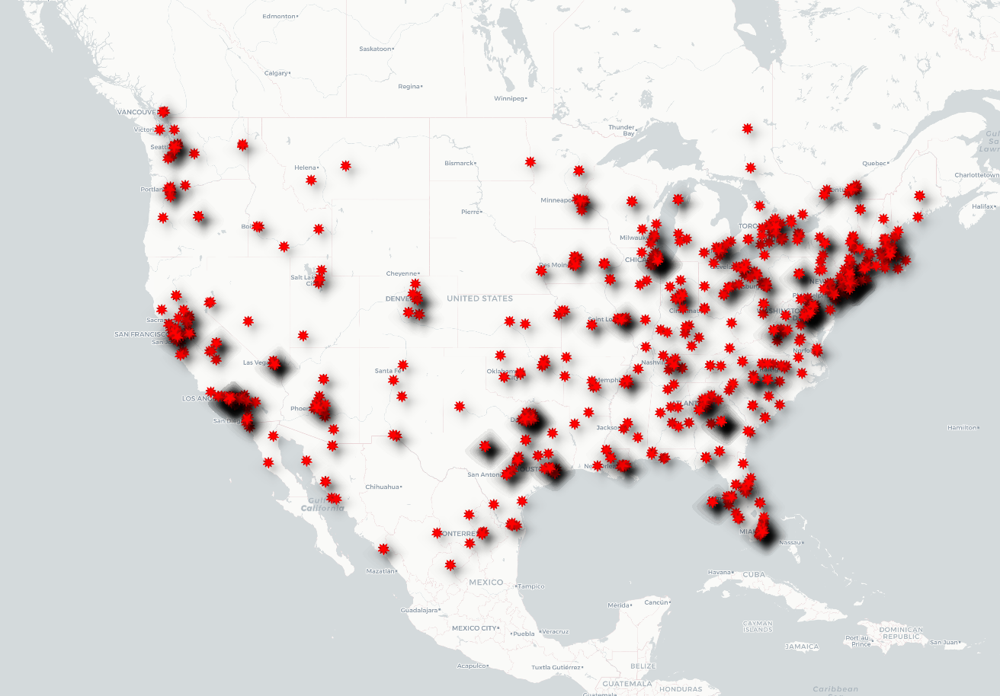

# Covid Related Tweets Visualization
## Lizhi Peng

The crawler collected recent tweets that mentioned the keyword "covid" and I mapped out their distributions on the U.S. map. Interestingly, the distribution of covid-related tweets seems to show similar trends as actual covid presence within the U.S. My theory is that areas more affected by covid tend to produce more covid-related tweets as people witness and experience its impact more frequently.

Covid map credits to [NBC News](https://www.nbcnews.com/health/health-news/coronavirus-u-s-map-where-virus-has-been-confirmed-across-n1124546)
